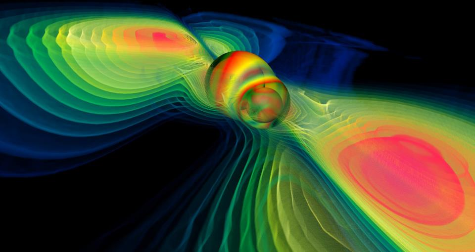

# Wie ward Licht? Mathematische Simulationen physikalischer Systeme (notes for a German math course)

*Hier entstehen Unterlagen zu einem Kurs auf der JGW-Schülerakademie in
Papenburg vom 25. Juli bis 4. August 2015, gehalten von Meru Alagalingam und
Ingo Blechschmidt. Die Illustration zeigt Gravitationswellen in der Raumzeit,
wie sie von bewegten Massen verursacht werden (Werner Benger, NASAblueshift).*

Im November 2014 landete die Raumsonde Philae nach zehn Jahren Flug auf dem
Kometen 67P/Tschurjumow-Gerassimenko. Die Reise war nur möglich, da man im
Vorhinein eine komplexe Trajektorie berechnen konnte, mit der man anhand von
mehreren Swing-By-Manövern an Mars und Erde die benötigte Treibstoffmenge auf
ein umsetzbares Maß reduzieren konnte. Im Jahr 1888 wies Heinrich Hertz die
Existenz von Radiowellen nach. Schon wenige Jahre später wurde mit der ersten
Funkverbindung eine nachhaltige Entwicklung ausgelöst, die die Welt dauerhaft
veränderte und näher zusammenrückte.

Diese Errungenschaften waren nur möglich, da man die zugrundeliegenden
physikalischen Phänomene mathematisch präzise beschreiben konnte. Etwa
kulminierten Jahrzehnte der empirischen Forschung an Strömen und Magnetfeldern
in den vier kurzen und eleganten Maxwell-Gleichungen, die alle Aspekte der
klassischen Elektrodynamik einfangen.

Dieser Kurs setzt sich mit diesen und anderen Kulturgütern aus der Physik von
einer mathematischen, physikalischen und informatischen Seite auseinander. Dazu
werden zunächst Methoden und Konzepte aus der reinen Mathematik behandelt:
Differential- und Integralrechnung, Vektoranalysis, Differentialformen und
Tensorfelder im Mehrdimensionalen sowie etwas Differentialtopologie. Mit diesem
Rüstzeug ausgestattet können wir die Sprache verstehen, in der in der Physik
auf universitärem Niveau Naturgesetze formuliert werden: als gewöhnliche und
partielle Differentialgleichungen.

Damit wendet sich der Kurs vielfältigen physikalischen Phänomenen und Theorien
zu, wie etwa klassischer Mechanik, Orbitalmechanik, Fluiddynamik und
Elektrodynamik. Diese werden nicht nur theoretisch beleuchtet: Parallel erfolgt
die  praktische Arbeit mit Python, einer Programmiersprache, die sich in
Wirtschaft und Wissenschaft großer Beliebtheit erfreut. Damit schreiben die
Teilnehmenden Computerprogramme, die physikalische Systeme numerisch
simulieren. Das ist nützlich um ein besseres Verständnis für die Physik zu
entwickeln und die aufgestellten Modelle zu verwenden, um Vorhersagen zu
treffen. Als weniger tiefsinniger, aber trotzdem interessanter Nebeneffekt
springt außerdem die Entwicklung von Videospielen dabei heraus.

Spaß an mathematisch-logischer Denkweise wird vorausgesetzt, wenn
auch tatsächliche mathematische Techniken, die über die Mittelstufe
hinausgehen, nicht benötigt bzw. im Kurs eingeführt werden. Praktische
Erfahrung mit dem Programmieren in einer beliebigen Sprache ist hilfreich, aber
nicht notwendig. Der Kurs richtet sich an alle mit mathematischem,
physikalischem oder informatischem Interesse.
